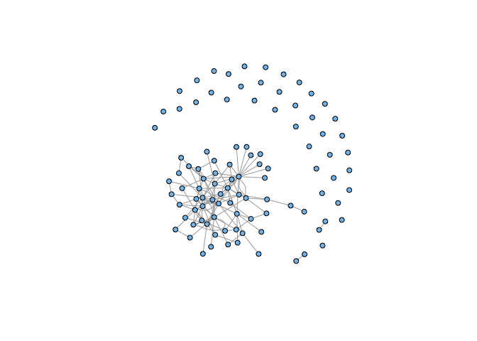
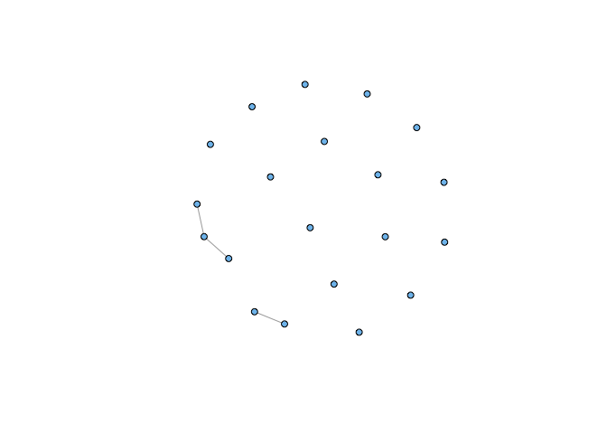
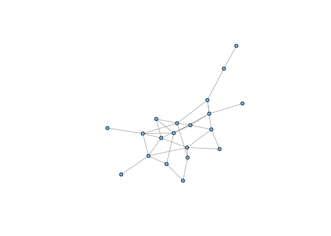

Novel coronavirus (COVID19) has a quite high estimated *R*0,
with values ranging from around
[2.2](https://doi.org/10.1056/NEJMoa2001316) to recent extreme estimates
in [excess of
6](https://www.medrxiv.org/content/10.1101/2020.02.07.20021154v1). Given
such robust values of the reproduction number, we should expect
substantial secondary spread beyond the initial epidemic focus in Wuhan.
However, it has not spread beyond China (and indeed Wuhan) to the extent
that we might expect, given this high reproduction ratio. Kyra Grantz,
Jess Metcalf, and Justin Lessler [recently
suggested](https://hopkinsidd.github.io/nCoV-Sandbox/DispersionExploration.html)
that a high degree of transmission heterogeneity might explain this.
They calculate that the epidemiological facts are consistent with a
model where 80% of infections are caused by 10% of the cases.

This is [consistent](https://doi.org/10.1056/NEJMp2000929) with our
prior knowledge about coronaviruses, namely, that they show quite skewed
transmission. That is, coronavirus transmission dynamics are
characterized by the presence of super-spreaders. While the presence of
super-spreaders is obviously not good, there is an upside. In
particular, the presence of a few super-spreaders can drag the expected
number of secondary cases (which is what *R*0 is at the
outset of an epidemic) out toward the tail that they define. Now, the
estimate of *R*0 for the various serious coronavirus diseases
(e.g., SARS, MERS, COVID19) are reasonably low in the grand scheme of
things. The only way you can have super-spreaders (like the man who
contracted MERS in Saudi Arabia, traveled back to Korea and generated
186 cases there) and a value of *R*0 on the order of 1-2 (or
even 4-6) is for most people to infect a very small number of new
people. The distribution of secondary cases is highly skewed and the
mode probably less than one.

The intuition behind Grantz and colleagues’ explanation of the
epidemiological facts of COVID19 is that, if we assume that the expected
number of secondary cases a person is likely to generate is a feature of
their physiology or the circumstances of their infection (i.e., it can
be thought of as a trait they take with them) and you pick people at
random with respect to this distribution, you are likely to sample
mostly people who are not going to generate lots of secondary cases. As
a result, the infection chains emanating from them are more likely to
die out quickly and the amount of epidemic dispersal will be limited.

This interpretation has a lot in common with the problem of sampling
networks. Indeed, it can actually be thought of as a network-sampling
problem. It is well known that a random sample of the vertices of a
network will lead to a biased sample of the network’s edges, and
vice-versa. This is the basis of the famous friendship paradox, first
noted by [Scott Feld](https://doi.org/10.1086/229693), namely that your
friends have more friends than you do. When the degree distribution of a
graph is heterogeneous, and your sample is random with respect to
vertex, you will likely under-sample the edges of the graph, making the
induced subgraph arising from the sampling possibly far less connected
than the parent graph.

We’ll construct a network with a negative binomial degree distribution.
Mark Handcock and I [showed](https://doi.org/10.1016/j.tpb.2003.09.006)
that the heterogeneity of sexual network degree is well-described by a
negative binomial and there is a long tradition in epidemiology of
thinking about the distribution of secondary cases following a negative
binomial.

A straightforward way to create a network with a negative binomial
degree distribution is to generate a vector of gamma random numbers. We
then treat these values as vector of rate parameters for a Poisson
random numbers. The marginal distribution of a Poisson r.v. with
gamma-distributed rate parameter is negative binomial. We’ll aim for
something that is pretty skewed without being too crazy. We can then
construct a network with our fixed (negative binomial) degree sequence
using the `igraph` function `sample_degseq()`.

    library(igraph)
    set.seed(8675309)
    rates <- rgamma(100, shape=2.5/5, scale=5)
    deg <- rpois(100,lambda=rates)
    g <- sample_degseq(deg, method="simple")
    plot(g, vertex.size=5, vertex.label=NA, vertex.color="skyblue2")

We get a network with a large, strongly-connected component and quite a
few isolates. Now we pick a random sample of vertices of our graph.

    ss <- sample(1:100, 20, replace=FALSE)
    sg <- induced_subgraph(g,vids=ss)
    sg <- simplify(sg)
    plot(sg, vertex.size=5, vertex.label=NA, vertex.color="skyblue2")

Note that this is not simply a result of taking a small sample of our
graph. If we choose correctly, we can recreate a strongly-connected
induced subgraph:

    sel <- c(3,4,9,16,17,18,19,21,22,25,61,62,64,67,68,85,87,88,92,94)
    sg1 <- induced_subgraph(g,vids=sel)
    sg1 <- simplify(sg1)
    plot(sg1, vertex.size=5, vertex.label=NA, vertex.color="skyblue2")

It’s a bit abstract, but it shouldn’t be too difficult to convince
yourself that we could represent the number of potential secondary
transmission events from a given case as a network. An epidemic is
indicated if the resulting graph is strongly-connected. Sampling the
vertices of the heterogeneous network (analogous to moving away from the
epidemic focus in Wuhan) leads to an unconnected subgraph and the
epidemic dies out.
