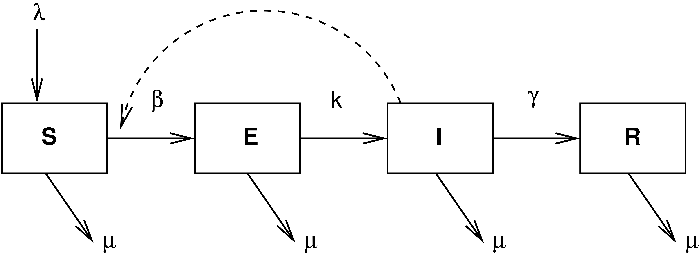

```{r setup, include=FALSE}
knitr::opts_chunk$set(echo = TRUE)
```

# Numerically-Integrating ODEs in `R`

We do this using the package `deSolve`, which has some excellent learning [resources](https://cran.r-project.org/web/packages/deSolve/index.html) to support it (check out the vignettes). 

## SIR Model

- Simple model for a closed-population (i.e., no births or deaths)

- Need to write a function that encodes the system of equations

- The function takes three arguments `t`, `x`, and `parms`

    - these are the time over which the equations are integrated, the state values (i.e., S,I, and R), and the model parameters

- The function starts by renaming the elements of the state vector `x` as things that make the equations easier to read -- e.g., `I` instead of `x[2]`

- The line `with(as.list(parms)` can take some unpacking

    - Using `with()` means setting up a local scope for variables
    - `as.list()` coerces our vector of parameters into a list
    - these two elements allow us to write the equations in a simple and readable way
    - Note we don't have to say something like `parms["beta"]` or `parms[3]` in order to use that parameter in our equation

```{r, cache=TRUE}
## if you haven't already
#install.packages(deSolve)
require(deSolve)
sir <- function(t,x,parms){
    S <- x[1]
    I <- x[2]
    R <- x[3]
  with(as.list(parms),
{
    dS <- -beta*S*I
    dI <- beta*S*I - nu*I
    dR <- nu*I
    res <- c(dS,dI,dR)
  list(res)
})
}
```

- In order to integrate the equations, use the function `lsoda()` (which is the solver we use) or `ode()` (which is a wrapper for different types of solvers including `lsoda`)

- We pass the solver the initial state vector, the times, the name of our function that describes the system of equations, and the vector of parameters

- The solver will return the solutions as a matrix; we coerce this using `data.frame()` to make it easier to work with, plot, etc.

- Once we have the data frame, we name the columns to make them easier to refer to

```{r, cache=TRUE}
N <- 1e4
parms <- c(N=N,beta=0.0001, nu = 1/7)
times <- seq(0,30,0.1)
x0 <- c(N-1,1,0)
stateMatrix <- as.data.frame(lsoda(x0,times,sir,parms))

colnames(stateMatrix) <- c("time","S","I","R")
plot(stateMatrix[,"time"], stateMatrix[,"S"], type="l", lwd=2, col="blue",
     xlab="Time", ylab="Population Size")
lines(stateMatrix[,"time"], stateMatrix[,"I"], col="red", lwd=2)
lines(stateMatrix[,"time"], stateMatrix[,"R"], col="green", lwd=2)
legend("right", c("S","I","R"), col=c("blue","red","green"), lwd=2)
```

Plot the phase portrait.

```{r}
plot(stateMatrix[,"S"], stateMatrix[,"I"], type="l", lwd=2, col="blue",
     xlab="Suseptible", ylab="Infected")
```


## Measles Model



- Susceptible, Exposed, Infected, Recovered (SEIR) model

- Use parameterization from [Ottar Bjornstad](http://bio.psu.edu/directory/onb1) (a.k.a., "The Measles Man")

- Open population of constant size (birth rate = death rate ($\mu$))

- Include vaccinated fraction $p$

- Model is a damped oscillator

Based on this parameterization, what is the life expectancy of individuals in the population? How long is the latent period? How long are cases infectious?


```{r, cache=TRUE}
seir <- function(t,x,parms){
    S <- x[1]
    E <- x[2]
    I <- x[3]
    R <- x[4]
  with(as.list(parms),{
    dS <- mu*(N*(1-p)-S) - beta*S*I/N
    dE <- beta*S*I/N - (mu + sigma)*E
    dI <- sigma*E-(mu+gamma)*I
    dR <- gamma*I-mu*R+ mu*N*p
    res <- c(dS,dE,dI,dR)
    list(res)
  })
}

times <-  seq(0, 30, by = 1/52)
parms <-  c(mu = 1/75, N = 1, p = 0, beta = 1250, sigma = 365/7, gamma = 365/7)
xstart = c(S = 0.06, E = 0, I = 0.001, R = 0)
stateMatrix <-  as.data.frame(lsoda(xstart, times, seir, parms))
##
colnames(stateMatrix) <- c("time","S","E", "I","R")
plot(stateMatrix[,"time"], stateMatrix[,"I"], type="l", lwd=2, col="blue",
     xlab="Time", ylab="Fraction Infected")
```

Spiralize! (i.e., plot the phase portrait)

```{r, cache=TRUE}
plot(stateMatrix[,"S"], stateMatrix[,"I"], type="l", lwd=2, col="blue",
     xlab="Susceptible", ylab="Infected")
```

Calculate the power spectrum. We'll trim the plot for all periods greater than 2.5 yrs, since the power is essentially zero for all such periods. 

```{r, cache=TRUE}
spec <- spectrum(stateMatrix$I, log="no", spans=c(2,2), plot=FALSE)
delta <- 1/52
plot(spec$freq[1:84]/delta, 2*spec$spec[1:84], type="l", lwd=2, col="red", xlab="Period", ylab="Spectrum")
fmax <- which(spec$spec==max(spec$spec))
1/spec$freq[fmax]
```


## Lorenz Attractor, Just for Grins

The [Lorenz Attractor](http://mathworld.wolfram.com/LorenzAttractor.html) is a classic model for dynamical systems and I include it to give you another example of numerically integrating a system of equations in `deSolve`.

```{r, cache=TRUE}
lorenz <- function(t, state, p) {
    with(as.list(c(state, parms)), {

        dx <- sigma*(y - x)
        dy <- x*(rho - z) - y
        dz <- x*y - beta*z

        list(c(dx, dy, dz))
    })
}

parms <- c(sigma=10, beta=8/3, rho=28)
y0 <- c(x = 1, y = 1, z = 1)
y0p <- y0 + c(1e-6, 0, 0)
times <- seq(0, 100, 0.01)

out <- ode(y = y0, times = times, func = lorenz, parms = parms)
out2 <- ode(y = y0p, times = times, func = lorenz, parms = parms)

plot(out[,"x"], out[,"y"], type="l", lwd=0.25, main = "Lorenz butterfly", xlab = "x", ylab = "y")
plot(out[,"x"], out[,"z"], type="l", lwd=0.25, main = "Lorenz butterfly", xlab = "x", ylab = "z")
plot(out[,"y"], out[,"z"], type="l", lwd=0.25, main = "Lorenz butterfly", xlab = "y", ylab = "z")
```