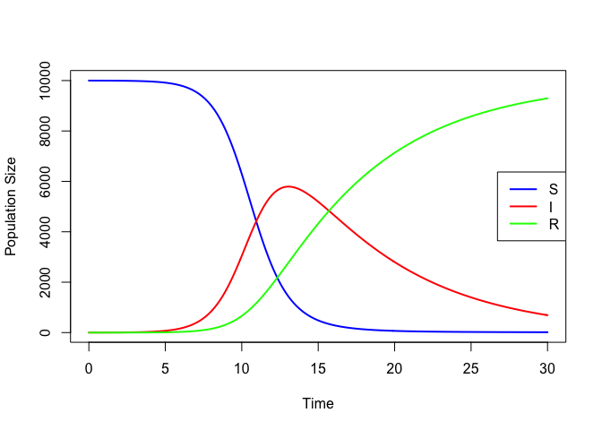
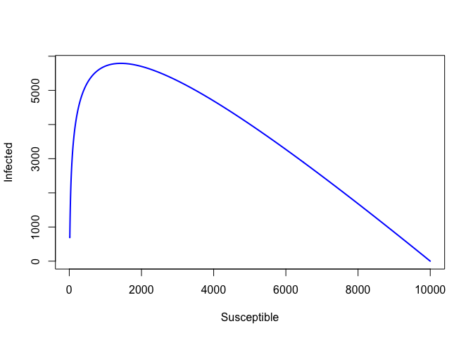
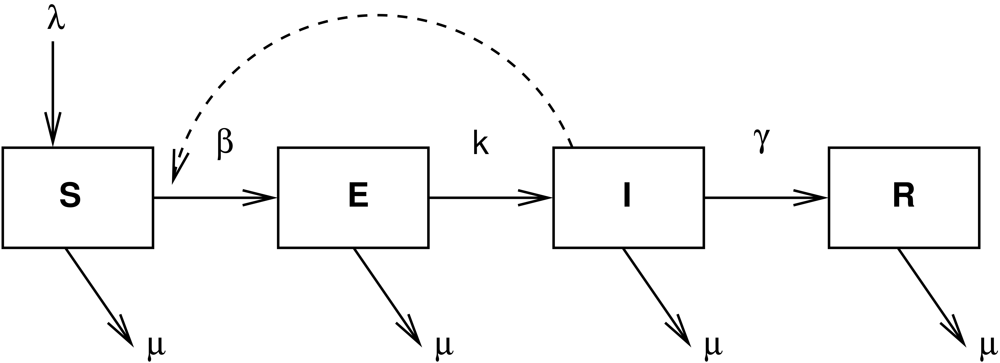
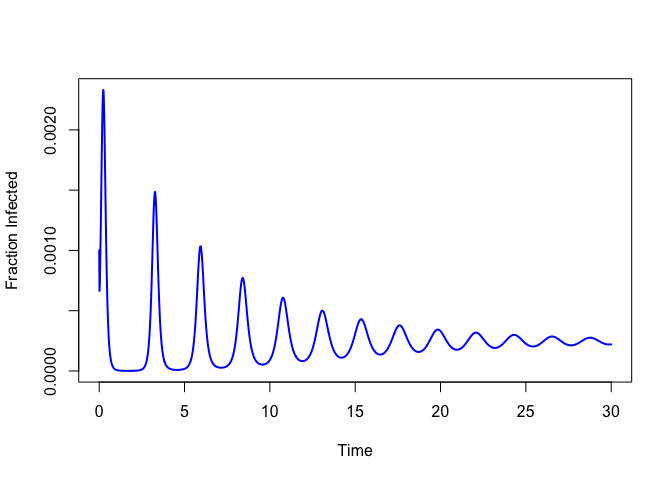
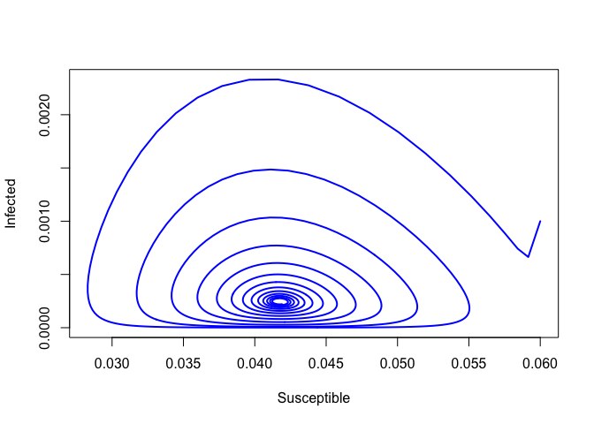
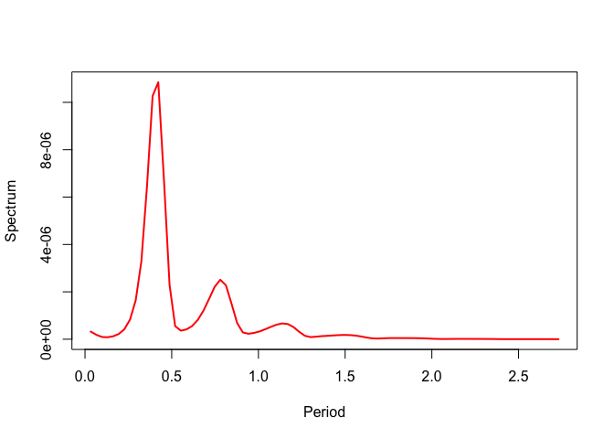
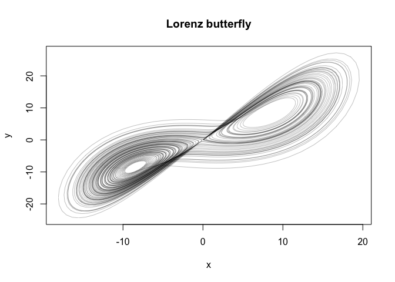
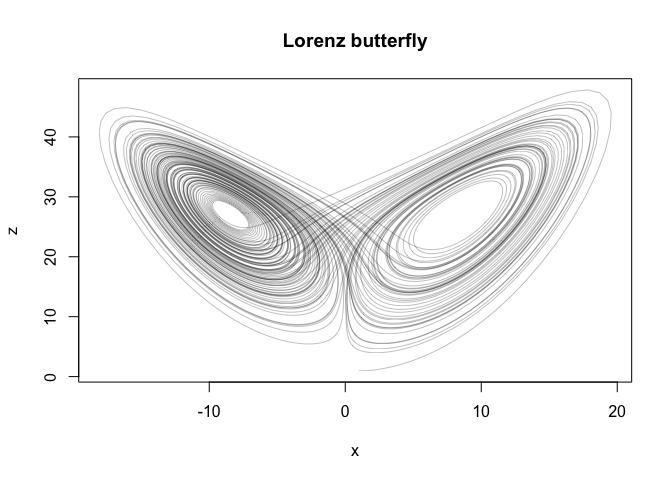
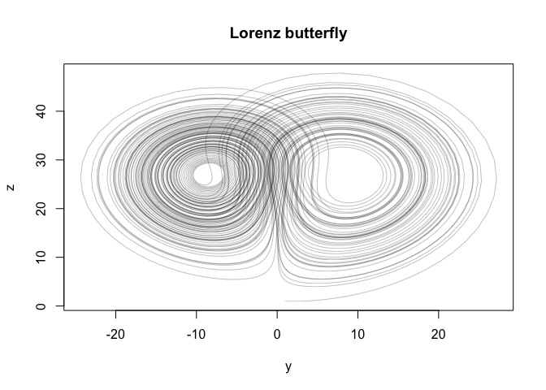

Numerically-Integrating ODEs in `R`
===================================

We do this using the package `deSolve`, which has some excellent
learning
[resources](https://cran.r-project.org/web/packages/deSolve/index.html)
to support it (check out the vignettes).

SIR Model
---------

-   Simple model for a closed-population (i.e., no births or deaths)

-   Need to write a function that encodes the system of equations

-   The function takes three arguments `t`, `x`, and `parms`

    -   these are the time over which the equations are integrated, the
        state values (i.e., S,I, and R), and the model parameters

-   The function starts by renaming the elements of the state vector `x`
    as things that make the equations easier to read – e.g., `I` instead
    of `x[2]`

-   The line `with(as.list(parms)` can take some unpacking

    -   Using `with()` means setting up a local scope for variables
    -   `as.list()` coerces our vector of parameters into a list
    -   these two elements allow us to write the equations in a simple
        and readable way
    -   Note we don’t have to say something like `parms["beta"]` or
        `parms[3]` in order to use that parameter in our equation

<!-- -->

    ## if you haven't already
    #install.packages(deSolve)
    require(deSolve)

    ## Loading required package: deSolve

    sir <- function(t,x,parms){
        S <- x[1]
        I <- x[2]
        R <- x[3]
      with(as.list(parms),
    {
        dS <- -beta*S*I
        dI <- beta*S*I - nu*I
        dR <- nu*I
        res <- c(dS,dI,dR)
      list(res)
    })
    }

-   In order to integrate the equations, use the function `lsoda()`
    (which is the solver we use) or `ode()` (which is a wrapper for
    different types of solvers including `lsoda`)

-   We pass the solver the initial state vector, the times, the name of
    our function that describes the system of equations, and the vector
    of parameters

-   The solver will return the solutions as a matrix; we coerce this
    using `data.frame()` to make it easier to work with, plot, etc.

-   Once we have the data frame, we name the columns to make them easier
    to refer to

<!-- -->

    N <- 1e4
    parms <- c(N=N,beta=0.0001, nu = 1/7)
    times <- seq(0,30,0.1)
    x0 <- c(N-1,1,0)
    stateMatrix <- as.data.frame(lsoda(x0,times,sir,parms))

    colnames(stateMatrix) <- c("time","S","I","R")
    plot(stateMatrix[,"time"], stateMatrix[,"S"], type="l", lwd=2, col="blue",
         xlab="Time", ylab="Population Size")
    lines(stateMatrix[,"time"], stateMatrix[,"I"], col="red", lwd=2)
    lines(stateMatrix[,"time"], stateMatrix[,"R"], col="green", lwd=2)
    legend("right", c("S","I","R"), col=c("blue","red","green"), lwd=2)

Plot the phase portrait.

    plot(stateMatrix[,"S"], stateMatrix[,"I"], type="l", lwd=2, col="blue",
         xlab="Susceptible", ylab="Infected")

Measles Model
-------------

-   Susceptible, Exposed, Infected, Recovered (SEIR) model

-   Use parameterization from [Ottar
    Bjornstad](http://bio.psu.edu/directory/onb1) (a.k.a., “The Measles
    Man”)

-   Open population of constant size (birth rate = death rate (*μ*))

-   Include vaccinated fraction *p*

-   Model is a damped oscillator

Based on this parameterization, what is the life expectancy of
individuals in the population? How long is the latent period? How long
are cases infectious?

    seir <- function(t,x,parms){
        S <- x[1]
        E <- x[2]
        I <- x[3]
        R <- x[4]
      with(as.list(parms),{
        dS <- mu*(N*(1-p)-S) - beta*S*I/N
        dE <- beta*S*I/N - (mu + sigma)*E
        dI <- sigma*E-(mu+gamma)*I
        dR <- gamma*I-mu*R+ mu*N*p
        res <- c(dS,dE,dI,dR)
        list(res)
      })
    }

    times <-  seq(0, 30, by = 1/52)
    parms <-  c(mu = 1/75, N = 1, p = 0, beta = 1250, sigma = 365/7, gamma = 365/7)
    xstart = c(S = 0.06, E = 0, I = 0.001, R = 0)
    stateMatrix <-  as.data.frame(lsoda(xstart, times, seir, parms))
    ##
    colnames(stateMatrix) <- c("time","S","E", "I","R")
    plot(stateMatrix[,"time"], stateMatrix[,"I"], type="l", lwd=2, col="blue",
         xlab="Time", ylab="Fraction Infected")

Spiralize! (i.e., plot the phase portrait)

    plot(stateMatrix[,"S"], stateMatrix[,"I"], type="l", lwd=2, col="blue",
         xlab="Susceptible", ylab="Infected")

Calculate the power spectrum. We’ll trim the plot for all periods
greater than 2.5 yrs, since the power is essentially zero for all such
periods.

    spec <- spectrum(stateMatrix$I, log="no", spans=c(2,2), plot=FALSE)
    delta <- 1/52
    plot(spec$freq[1:84]/delta, 2*spec$spec[1:84], type="l", lwd=2, col="red", xlab="Period", ylab="Spectrum")

    fmax <- which(spec$spec==max(spec$spec))
    1/spec$freq[fmax]

    ## [1] 123.0769

Lorenz Attractor, Just for Grins
--------------------------------

The [Lorenz
Attractor](http://mathworld.wolfram.com/LorenzAttractor.html) is a
classic model for dynamical systems and I include it to give you another
example of numerically integrating a system of equations in `deSolve`.

    lorenz <- function(t, state, p) {
        with(as.list(c(state, parms)), {

            dx <- sigma*(y - x)
            dy <- x*(rho - z) - y
            dz <- x*y - beta*z

            list(c(dx, dy, dz))
        })
    }

    parms <- c(sigma=10, beta=8/3, rho=28)
    y0 <- c(x = 1, y = 1, z = 1)
    y0p <- y0 + c(1e-6, 0, 0)
    times <- seq(0, 100, 0.01)

    out <- ode(y = y0, times = times, func = lorenz, parms = parms)
    out2 <- ode(y = y0p, times = times, func = lorenz, parms = parms)

    plot(out[,"x"], out[,"y"], type="l", lwd=0.25, main = "Lorenz butterfly", xlab = "x", ylab = "y")

    plot(out[,"x"], out[,"z"], type="l", lwd=0.25, main = "Lorenz butterfly", xlab = "x", ylab = "z")

    plot(out[,"y"], out[,"z"], type="l", lwd=0.25, main = "Lorenz butterfly", xlab = "y", ylab = "z")

