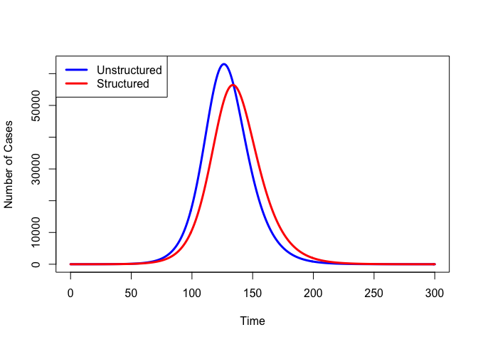
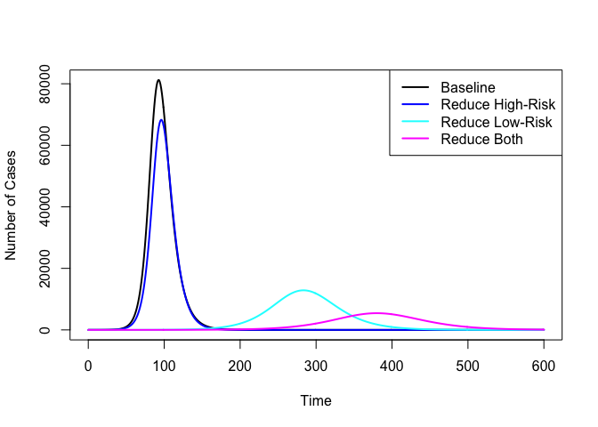
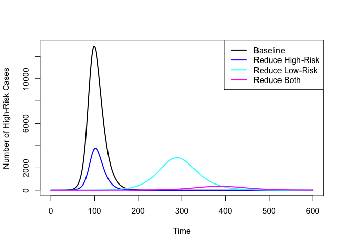

Mixing
======

Epidemic models, like the SIR model, involve dyads of individuals – one
susceptible and one infectious – coming together at a specified rate and
generating a new infection with a specified probability. We say that a
population is *well-mixed* if all infectious-susceptible dyads in the
population have approximately the same probability of occurring. This is
obviously a very strong assumption. For example, as a student at
Stanford, you are probably much more likely to encounter another
Stanford student infected with the flu than you are an infected student
at, say, the University of South Carolina.

We can relax the assumption of a population being well-mixed by adding
structure to it. The resulting model will be characterized by
*structured mixing*, meaning that there are potentially quite different
probabilities associated with dyads that can be formed from the various
elements of structure. This structure can represent geographic location
(e.g., Palo Alto, CA vs. Columbia, SC) or it can represent various
mechanisms by which social or cultural attributes affect the way people
interact, e.g., race/ethnicity, age, gender, occupation, social class,
income quartile, etc.

Whatever the nature of the structuring, there are certain generic
features of structured epidemic models. First, **structuring slows down
epidemics**. Second, **structuring typically leads to smaller
epidemics**. As I revise these notes in the midst of COVID19
social-distancing efforts, these points have taken on a new urgency.

We can construct a toy example to show this qualitative behavior. We
will compare two SIR models, one well-mixed and the other structured
into two asymmetrically-mixing groups. For the well-mixed model, we will
assume that the effective contact rate is *β* = 0.3 and the removal rate
of infectious individuals is *ν* = 0.2. For the structured model, we
will assume that the average effective contact rate is the same
*β̄* = 0.3, but that there is asymmetry in the contact rates such that
*β*11 = 0.5, *β*12 = 0.15,
*β*21 = 0.05, and *β*22 = 0.5, where
*β**i**j* is the rate of transmission from infectious
individuals in class *j* to susceptible individuals in class *i*. Assume
that the removal rate is the same for both classes, *ν* = 0.2.

Plot the epidemic (i.e., incidence) curves for the two models.

Note that the structured epidemic is slower to take off and infects a
smaller fraction of the population even though it technically has a
higher *R*0. Importantly, from a healthcare-logistics
perspective, the peak number of cases is lower. Even if an epidemic
cannot be avoided, delaying it buys time to develop vaccines,
treatments, etc. and reducing the peak of cases makes it more likely
that healthcare systems’ capacity will not be overwhelm.

    ## R_0 = beta/nu = 1.5
    0.3 * 5

    ## [1] 1.5

    ## R_0 dominant eigenvalue of G = 2.93
    G <- matrix(c(0.5, 0.15, 0.05, 0.5)*5, nr=2, nc=2, byrow=TRUE)
    eigen(G)$values

    ## [1] 2.933013 2.066987

Flattening the Epidemic Curve When Mixing Is Heterogeneous
----------------------------------------------------------

As I write these notes, the pandemic respiratory infection caused by the
[SARS-CoV-2 virus,
COVID-19](https://www.who.int/emergencies/diseases/novel-coronavirus-2019/technical-guidance/naming-the-coronavirus-disease-(covid-2019)-and-the-virus-that-causes-it),
is sweeping the United States. One of the major concerns of COVID-19 is
that there is a substantial subpopulation that is particularly
vulnerable to serious complications and death from infection. In
particular, there is mounting evidence that COVID-19 is especially
dangerous for the elderly.

This observation leads to some obvious public-health policy questions.
What is the best way to protect a vulnerable subpopulation? In
particular, should we isolate members of vulnerable sub-populations
through quarantine or social-distancing efforts?

We can use our simple structured-mixing model to investigate what
happens when we reduce the contact rates (e.g., through social
distancing efforts) of the high-risk population, the lower-risk
population, or both.

We will explore four sets of parameters reflecting:

1.  Baseline conditions
2.  Reduction of contact rates with the high-risk subpopulation
3.  Reduction of contact rates with the low-risk subpopulation
4.  Global reduction of contact rates

We assume that the contact rates within the low-risk subpopulation are
higher than either the contact rates within the high-risk subpopulation
or between subpopulations. This assumption follows from the fact that
the high-risk subpopulation is older and less likely to be engaged in
the workforce, etc. We retain the assumption from above that there is an
asymmetry in transmission between groups. This arises from the fact that
caretakers of the elderly are typically younger and therefore in the
low-risk subpopulation. A sick elderly person is more likely to transmit
to their young caregiver than a young person is to an elderly
individual. As with everything else, this is an assumption that can be
played around with and perhaps even left as an exercise.

We should think a bit about mortality rates. These are necessarily
higher in the high-risk subpopulation (that’s what makes them
high-risk). Note, however, that in the equations describing our
structured SIR model, we simply have a constant removal rate. The term
“removal rate” covers a multitude of sins. One can be removed from the
infectious compartment by a number means, e.g., through recovery, death,
quarantine, emigration from the affected region, etc. In order not to
complicate our simple model too much, we will simply retain the
assumption that our *ν**i* terms incorporate both recovery
and mortality. Since it is quite likely that there could actually be
opposite effects on the *ν**i* if people in the high-risk
population experience greater mortality rates but also slower recovery.
For now, we’ll stick with a single removal rate, *ν*. While the details
of recovery and mortality rates would be very important if we were
developing a tactical model to help with formulating detailed policy
recommendations, our model here is strategic and more concerned with
acquiring a general understanding of the consequences of changed contact
rates on epidemic dynamics.

We will also modify the starting population since there are fewer people
in the high-risk subpopulation.

We will assume that we can cut the contact rates with the high-risk
subpopulation in half, but that we can’t reduce the contact rates with
the low-risk subpopulation as much. This follows from the fact that
members of the high-risk subpopulation are more likely to not be engaged
in the workforce and may be more easily epidemiologically isolated.

As I said above, all these assumptions can be modified and you should
probably expect future assignments in which you will be asked to
investigate departures from the simple model presented here.

Because we are slowing down the epidemic, we will also extend the time
over which we integrate the model.

    # baseline from before
    parms1 <- c(N=N, beta11=0.5, beta12=0.15, beta22=0.5, beta21=0.05, nu=1/5)
    # reduce high-risk contact
    ## beta21 and beta22 define transmission to group 2 and incorporate
    ## contact rates along with transmissibility
    ## reduce these betas by half
    parms2 <- c(N=N, beta11=0.5, beta12=0.15, beta22=0.25, beta21=0.025, nu=1/5)
    # reduce low-risk contact
    # assume we can only reduce by a third
    parms3 <- c(N=N, beta11=0.335, beta12=0.1, beta22=0.5, beta21=0.05, nu=1/5)
    # reduce both
    parms4 <- c(N=N, beta11=0.335, beta12=0.1, beta22=0.25, beta21=0.025, nu=1/5)
    z0 <- c(2*(N-1)/3,0.5,0,(N-1)/3,0.5,0,1)
    times <- seq(0,600,1)

Now run the models.

    ## baseline
    stateMatrix1 <- ode(y=z0, times, hsir, parms1)
    colnames(stateMatrix1) <- c("Time","S1","I1","R1","S2","I2","R2","C")
    ## reduce high-risk contact
    stateMatrix2 <- ode(y=z0, times, hsir, parms2)
    colnames(stateMatrix2) <- c("Time","S1","I1","R1","S2","I2","R2","C")
    ## reduce low-risk contact
    stateMatrix3 <- ode(y=z0, times, hsir, parms3)
    colnames(stateMatrix3) <- c("Time","S1","I1","R1","S2","I2","R2","C")
    ## reduce both
    stateMatrix4 <- ode(y=z0, times, hsir, parms4)
    colnames(stateMatrix4) <- c("Time","S1","I1","R1","S2","I2","R2","C")

    ## plot epidemic curves
    # baseline
    plot(stateMatrix1[,"Time"], (stateMatrix1[,"I1"] + stateMatrix1[,"I2"]), 
      type="l", lwd=2, col="black",
      xlab="Time", ylab="Number of Cases")
    # reduce high-risk
    lines(stateMatrix2[,"Time"], (stateMatrix2[,"I1"] + stateMatrix2[,"I2"]), type="l", lwd=2, col="blue")
    # reduce low-risk
    lines(stateMatrix3[,"Time"], (stateMatrix3[,"I1"] + stateMatrix3[,"I2"]), type="l", lwd=2, col="cyan")
    # reduce both
    lines(stateMatrix4[,"Time"], (stateMatrix4[,"I1"] + stateMatrix4[,"I2"]), type="l", lwd=2, col="magenta")
    legend("topright", c("Baseline","Reduce High-Risk", "Reduce Low-Risk", "Reduce Both"), col=c("black","blue","cyan","magenta"), lwd=2)

We should probably check that these dramatic differences in epidemic
curves are not simply driven by changes in the low-risk population,
though the dramatic differences in the peak size of the epidemic is
reassuring.

    ## plot epidemic curves
    # baseline
    plot(stateMatrix1[,"Time"], stateMatrix1[,"I2"], 
      type="l", lwd=2, col="black",
      xlab="Time", ylab="Number of High-Risk Cases")
    # reduce high-risk
    lines(stateMatrix2[,"Time"], stateMatrix2[,"I2"], type="l", lwd=2, col="blue")
    # reduce low-risk
    lines(stateMatrix3[,"Time"], stateMatrix3[,"I2"], type="l", lwd=2, col="cyan")
    # reduce both
    lines(stateMatrix4[,"Time"], stateMatrix4[,"I2"], type="l", lwd=2, col="magenta")
    legend("topright", c("Baseline","Reduce High-Risk", "Reduce Low-Risk", "Reduce Both"), col=c("black","blue","cyan","magenta"), lwd=2)

 Note the
very different range of the y-axis!

This stupidly simple model makes the stark point that if we want to
control an epidemic in a heterogeneous population, we should target the
segment of the population that generates the most infections. This will
often be the same segment of the population that is least at-risk for
the most severe consequences of infection. This model provides the logic
underlying what may seem like draconian social-distancing interventions
(e.g., closing schools, canceling public gatherings).
